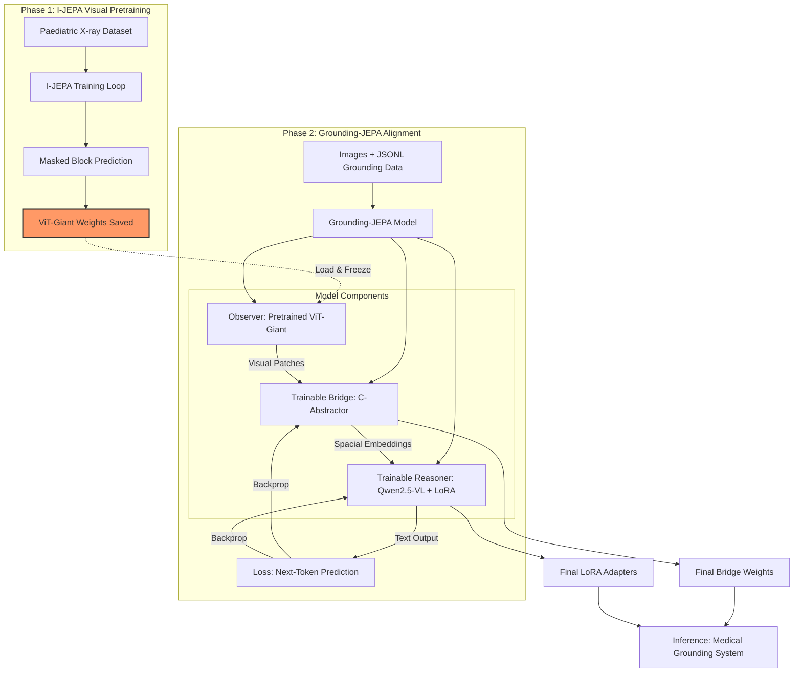

# Grounding-JEPA Architecture

This project implements the **Grounding-JEPA** architecture for Medical Image Grounding (MIG). The architecture is designed to leverage world-model features for precise anatomical understanding and spatial localization in X-ray scans.

## Architecture Overview

The model is divided into three functional blocks: **The Observer**, **The Bridge**, and **The Reasoner**.

### 1. The Observer (Vision)
- **Backbone**: I-JEPA (Image Joint-Embedding Predictive Architecture)
- **Input**: 224 x 224 high-resolution X-ray scans.
- **Logic**: Predicts missing anatomical structures in latent space, providing built-in anatomical continuity.
- **Output**: Patch-level embeddings (32 x 32 grid = 1024 tokens).
- **Configuration**: Uses `patch_size=7` to achieve high spatial density.

### 2. The Bridge (Alignment)
- **Module**: `C-Abstractor` (Convolutional Abstractor).
- **Structure**: Lightweight convolutional block (stride 2) followed by an MLP.
- **Function**: Reduces the 1024 patch tokens from I-JEPA down to a manageable **256 "Visual Words"** while maintaining the spatial grid.
- **Goal**: Summarizes local anatomy for the LLM.

### 3. The Reasoner (Language)
- **Backbone**: Qwen2.5-VL-7B.
- **Input**: Visual tokens from C-Abstractor + Grounding Prompt.
- **Output Format**: Chain-of-Box (CoT) reasoning with final coordinates.
  - Template: `<think> Reasoning... </think> <answer> [x1, y1, x2, y2] </answer>`

## Project Structure

```text
Grounding-Jepa/
├── modules/
│   ├── observer.py   # I-JEPA Vision Backbone
│   ├── bridge.py     # C-Abstractor implementation
│   └── reasoner.py   # Qwen2.5-VL Language Reasoner
├── model.py          # Unified GroundingJepa Model
└── inference_example.py # Usage demonstration
```

## Setup and Usage

### Requirements
- `torch >= 2.5.1`
- `transformers` (latest with Qwen2.5-VL support)
- Pretrained I-JEPA weights (refer to `/nuvodata/User_data/shiva/ijepa`)
- access to Qwen2.5-VL-7B-Instruct

### Example Usage

```python
from model import GroundingJepa
import torch

# Initialize model
model = GroundingJepa(
    ijepa_variant='vit_huge',
    patch_size=7,
    qwen_model_id='Qwen/Qwen2.5-VL-7B-Instruct'
)

# Load pretrained weights (Optional)
# model.observer.load_pretrained('path/to/ijepa_checkpoint.pth')

# Prepare input
image = torch.randn(1, 3, 224, 224).cuda()
prompt = "Identify the pediatric lung field."
# Tokenize prompt...

# Forward pass
# output = model(image, input_ids)
```

## References
This implementation refers to:
- **MedGround-R1**: For Grounding-reasoning logic and training strategies.
- **I-JEPA**: For the world-model vision backbone.
- **Qwen2.5-VL**: For the state-of-the-art vision-language reasoning backbone.


## To Train Ijepa 
(ptca) shiva@neysa-kanpur:~/ijepa$ nohup python /nuvodata/User_data/shiva/ijepa/main.py --fname configs/xray_vitg16.yaml --devices cuda:1 cuda:2 cuda:3 cuda:4

## To Train Grounding-Jepa
cd /nuvodata/User_data/shiva/Grounding-Jepa
- Use a specific GPU, e.g., cuda:1
CUDA_VISIBLE_DEVICES=1 python train.py

## For Inference
cd /nuvodata/User_data/shiva/Grounding-Jepa
python test_inference.py

---

## Training Pipeline Deep Dive

### High-Level Flowchart
The pipeline consists of two major phases: **Self-Supervised Pretraining** (Medical Vision) and **Supervised Fine-tuning** (Reasoning Alignment).



### 1. Training Phase Breakdown
*   **Phase 1: I-JEPA Visual Pretraining**: Learn anatomical continuity. The model predicts missing parts of an X-ray to build a high-quality "Visual Tower" specialized in medical features rather than generic objects.
*   **Phase 2: Grounding-JEPA Alignment**: Connects the Vision (Observer) to the Language Brain (Reasoner).
    *   **Observer**: Stays **Frozen**. It provides the medical "eyes".
    *   **Bridge**: **Trainable**. It translates visual information into "Visual Words" the LLM can understand.
    *   **Reasoner**: **Trainable (LoRA)**. Learns to answer medical questions using the visual words.

### 2. Physical Data Flow
1.  **Input**: An X-ray image + a text question.
2.  **Vision Extraction**: The Observer extracts 1024 anatomical patch embeddings.
3.  **Visual Word Generation**: The C-Abstractor Bridge summarizes these into **64 tokens** and projects them into the 3584-dimensional space of the Reasoner.
4.  **Embedding Fusion**: The 64 visual tokens are **interleaved** into the text prompt sequence.
5.  **Reasoning Loss**: The Reasoner predicts the ground-truth medical answer token-by-token.

### 3. Reasoning Mechanism: Embedding Fusion (Step 4 Explained)
How does the model "see" the X-ray while "thinking" about the text?

*   **Token Interleaving**: The Qwen processor inserts special placeholders `<|vision_start|>` and `<|vision_end|>` into your text prompt. The 64 visual embeddings from the Bridge are physically injected between these markers.
*   **Joint Input Tensor**: The Transformer receives a unified sequence: `[Text Tokens... <start> Visual Token 1...64 <end> ...Text Tokens]`.
*   **Self-Attention Fusion**: Inside the Attention layers, each text word performs a mathematical dot-product with every visual token. This allows the model to "attend" to specific areas of the X-ray (like the lung base or hilar region) to decide which medical term to generate next.
*   **Dimensional Alignment**: The Bridge ensures that a "visual token" has the exact same mathematical properties as an "English word token," allowing for seamless cross-modal reasoning.